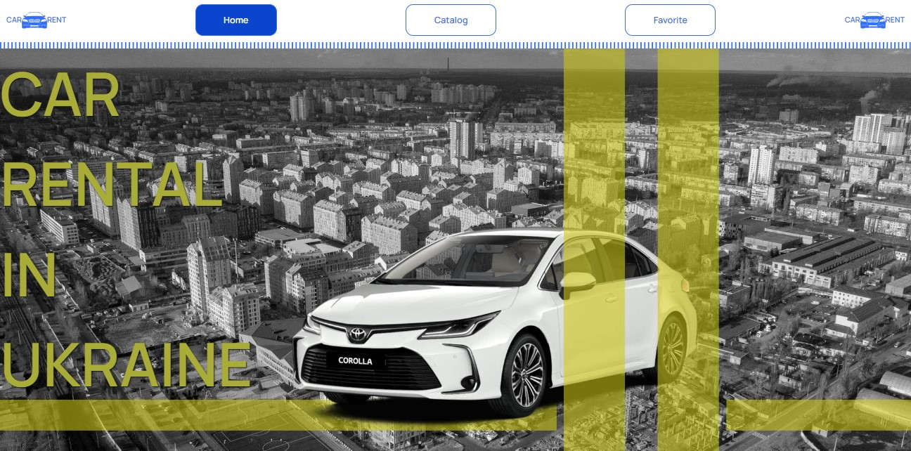
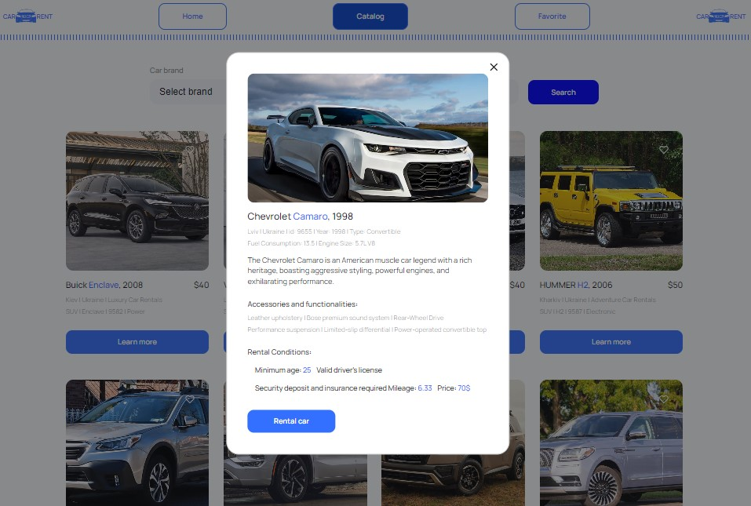

## Web Car Rental  

  
  

This project was created using [Create React App](https://github.com/facebook/create-react-app).  
Web application for browsing and managing car rentals.  
Users can view a list of available cars, filter them, and mark their favorites.

## Table of Contents ᎓  

[Web Car Rental](#web-car-rental)  
[Features](#features)  
[Technologies](#technologies)  
[Installation](installation)  

## Features :  

- View a list of available cars  
- Filter cars based on various criteria (e.g., brand, price)  
- Mark cars as favorites  
- Pagination for browsing through the car list 

## Twchnologies :  

</a>&nbsp;
  &nbsp;
  &nbsp;
  &nbsp;
  &nbsp;
  &nbsp;
  &nbsp;
  &nbsp;  
  
※ [React.js](https://react.dev): JavaScript library for building user interfaces.  
※ [Redux Toolkit](https://redux-toolkit.js.org): State management for React applications.  
※ [Styled Components](https://styled-components.com): Styling library for React components.  
※ [Axios](https://axios-http.com): HTTP client for database operation.  
※ [MockAPI](https://mockapi.io): Mock API for simulating backend data.  

## Installation :

To get started with this project, follow the installation instructions below.

1. Clone the repository:
   ```bash
   git clone https://github.com/Morifer79/project-car-rental.git
   cd car-rental-app
   ```
2. Install the dependencies:
   ```bash
   npm install
   ```
3. Start the development server:
   ```bash
   npm start
   ```
4. Open to view it in the browser:  
<a href="https://morifer79.github.io/project-car-rental/"></a>

## 𝔼𝕞𝕒𝕚𝕝 𝕞𝕖 ᎓  
Questions, suggestions, help:  
<a href="mailto:cyber-morifer@proton.me"></a>
   
